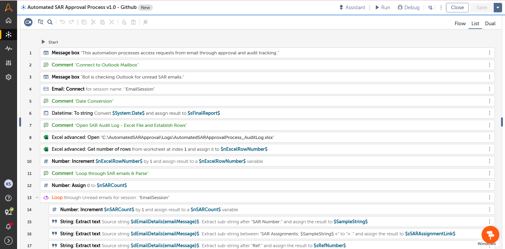
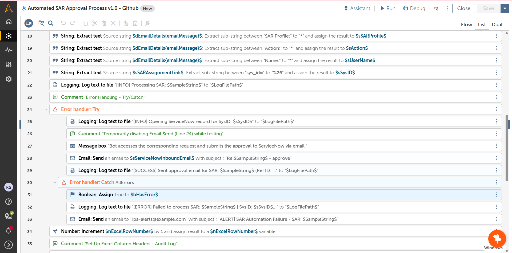
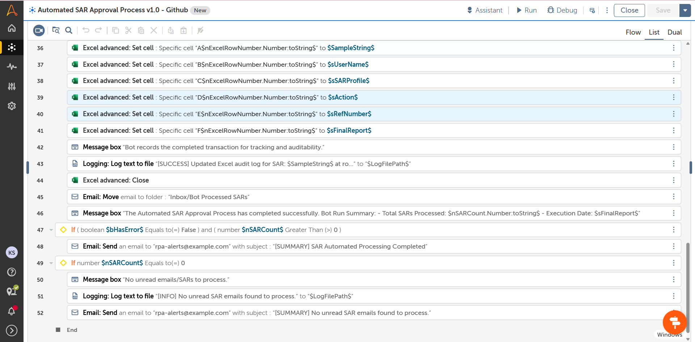

# Automated ServiceNow SAR Approvals (ASAP v1.0)


Headless enterprise task bot built in Automation Anywhere A360 to automate manual Service Access Request (SAR) approvals in ServiceNow, replacing UI-based interactions with ServiceNow's native inbound email gateway processing.

---

## Project Overview

Processing manual Service Access Requests (SAR) via a browser UI introduces DOM dependencies, session timeouts, and execution latency. The **Automated SAR Approval Process (ASAP)** bot monitors incoming approval notifications in Microsoft Outlook, parses critical metadata, and responds via ServiceNow's inbound email gateway to complete approvals headlessly.

* **Iteration 1 (UI-Based):** Initial version used browser automation and simulated keystrokes. While functional, UI loading latencies created execution overhead (~30s runtime per request) and brittle web element dependencies.
* **Iteration 2 (Headless Email Gateway):** Shifted to ServiceNow’s inbound email processor, eliminating browser dependencies entirely and reducing processing runtime by **~95% (1–2s per request)**.

Upon receiving the automated response, ServiceNow advances the approval state and triggers downstream Active Directory (AD) group provisioning.

---

## System Architecture & Workflow

```text
[ Outlook Inbox ] ──► ( Unread SAR Email )
                            │
                            ▼
           [ A360 Task Bot: String Extraction ]
           ├── Extract SAR ID, User Name, Profile, Ref ID
           └── Isolate `sys_id` from Query Parameter URL
                            │
                            ▼
           [ Background Email Dispatch ]
           └── Target: `wpcomain@service-now.com`
                            │
                            ▼
           [ ServiceNow Inbound Processor ]
           ├── Advances SAR Approval State
           └── Triggers Downstream AD Group Provisioning
                            │
                            ▼
           [ Post-Processing & Logging ]
           ├── Update Excel Audit Log (`ASAP_AuditLog_$sBotRunDate$.xlsx`)
           ├── Write Execution Log (`ASAP_ExecutionLog_$sBotRunDate$.txt`)
           └── Archive Email ──► `Inbox/Bot Processed SARs`
```
## Key Technical Achievements

* **Targeted Data Extraction:** Implemented multi-stage string-parsing logic to extract SAR numbers (`$SampleString$`), candidate names (`$sUserName$`), target profiles (`$sSARProfile$`), `Ref:MSG` watermarks (`$sRefNumber$`), and isolated unique `sys_id` parameters directly from assignment URL query strings (`sys_id=...%26`).
* **Headless Inbound Email Integration:** Replaced browser-based interaction with direct background email dispatching to ServiceNow (`wpcomain@service-now.com`), eliminating browser session timeouts and bypassing complex OAuth API configuration.
* **Dual-Layer Audit Trail & Dynamic File Management:** 
  * **Structured Audit Logging:** Appends transaction records (SAR ID, User Name, Profile, Action, Ref ID, Timestamp) directly to an Excel audit log (`$AuditLogPath$`) using the Excel Advanced package.
  * **Execution Logging:** Maintains detailed text milestone logs (`$LogFilePath$`), using dynamic run-date naming (`$sBotRunDate$`) and automated template fallback logic (`ASAP_ExecutionLog_Template.txt`) if a log file does not exist.
* **Structured Error Handling & Real-Time Alerting:** Wrapped main execution in a global `Try/Catch` block (`AllErrors`). On failure, the bot logs exception details, flags the error state (`$bHasError$ = True`), attaches the execution log (`$lLogFile$`), and automatically sends an alert email (`[ALERT] SAR Automation Failure...`) to administrators.
* **Inbox State Management & Summary Reporting:** Automatically archives processed emails to `Inbox/Bot Processed SARs` to guarantee single-pass execution, and dispatches dynamic execution summary notifications upon run completion.

## Results & Performance Impact

| Metric / Category | Iteration 1 (Browser UI) | Iteration 2 (ASAP v1.0 Email Bot) | Impact |
| :--- | :--- | :--- | :--- |
| **Execution Time** | ~30 seconds / request | **1–2 seconds / request** | **~95% Faster** |
| **System Dependency** | Brittle UI Navigation | **100% Headless Email Gateway** | Zero DOM Failure |
| **Error Handling** | Manual Discovery | **Automated Alerts w/ Log Attachments** | Instant Notification |
| **Provisioning Flow** | Manual Sign-off Required | **Instant AD Group Trigger** | Full End-to-End |

## Bot Implementation & Code Structure

The Automation Anywhere A360 Task Bot is structured sequentially across 61 logic steps:

| Lines 1–20: Setup & Data Extraction | Lines 21–40: Execution & Catch Block | Lines 41–61: Audit, Archiving & Summaries |
| :--- | :--- | :--- |
|  |  |  |
| Extracts metadata, `Ref:MSG` watermarks, and `sys_id` query strings. | Dispatches headless emails to ServiceNow and handles exception alerts. | Applies Excel audit logs, archives processed emails, and sends completion summaries. |handles exception alerts. | Applies Excel audit logs, archives processed emails, and sends completion summaries. |

## Repository Structure

```text
├── images/
│   ├── asap_bot_lines_1-20.png          # Screenshot of Lines 1-20 (Setup & Data Extraction)
│   ├── asap_bot_lines_21-40.png         # Screenshot of Lines 21-40 (Execution & Catch Block)
│   └── asap_bot_lines_41-61.png         # Screenshot of Lines 41-61 (Audit, Archiving & Summaries)
├── templates/
│   ├── ASAP_AuditLog_Template.xlsx      # Base Excel audit logging template
│   └── ASAP_ExecutionLog_Template.txt   # Base text execution logging template
├── src/
│   └── ASAP_v1.0_Email_TaskBot.bot      # A360 Task Bot export
└── README.md                            # Project documentation
```

## Future Enhancements
* Privileged Access Safeguards: Add validation rules to intercept target profiles containing high-risk keywords (e.g., Admin, CMS Handler) and route them for manual sign-off instead of auto-approval.
* Multi-Action Request Expansion: Extend business rules to process additional email request types (e.g., rejection, access removal, request cancellations).
* Direct REST API Gateway Integration: Transition email-based triggers to direct ServiceNow OAuth 2.0 REST API calls for instantaneous sub-second status updates.

## Tech Stack
 * **RPA Engine:** Automation Anywhere A360
 * **ITS Integration:** ServiceNow Inbound Email Gateway Processing
 * **Mail & File Systems:** Microsoft Outlook, Microsoft Excel Advanced, Native File System
 * **Data Processing:** String Extraction & Parsing, Dynamic File Initialization
 * **Resiliency:** Global Exception Handling (`Try/Catch`), Real-time Admin Alerting
